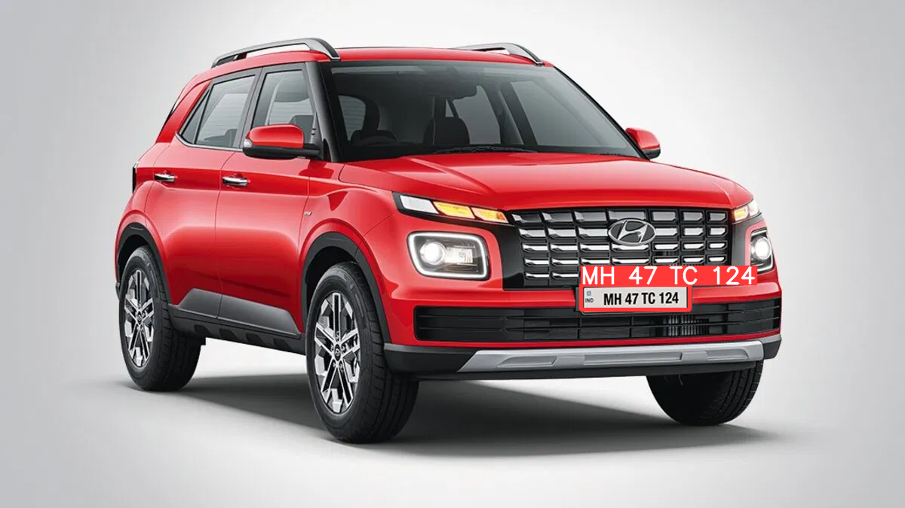
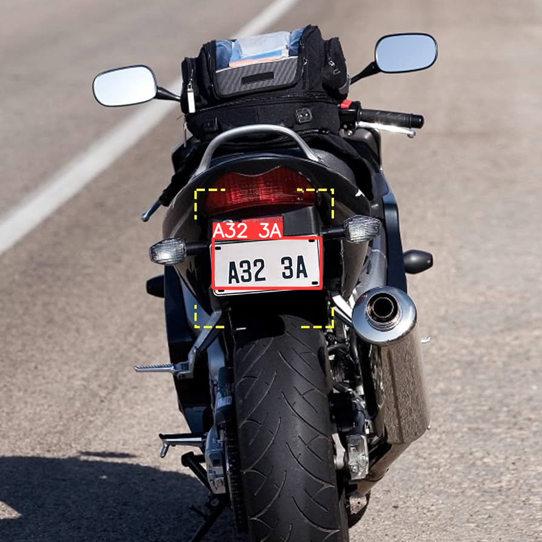

<H1 align="center">Number Plate Detection and Recognition using YOLOv8</H1>

## Steps to run Code

- Clone the repository

```
git clone https://github.com/kopsus/Number_Plate_Detection_Recognition_YOLOv8.git
```

- Goto the cloned folder.

```
cd Automatic_Number_Plate_Detection_Recognition_YOLOv8
```

- Install the dependecies

```
pip install -e '.[dev]'

```

- Setting the Directory.

```
cd ultralytics/yolo/v8/detect
```

- Downloading a Weights from the Google Drive

```
gdown "https://drive.google.com/uc?id=1dIyJooVaowaNUj0R1Q-HUnu-utiGsEj8&confirm=t"
```

- Downloading a Sample Video from the Google Drive

```
gdown "https://drive.google.com/uc?id=1P-oVR0J35Dw40lzw47sE19oADSW-tyb1&confirm=t"

```

- Run the code with mentioned command below (For Licence Plate Detection and Recognition).

```
python predict.py model='best.pt' source='demo.mp4'
```

### RESULTS

#### Licence Plate Detection and Recognition




